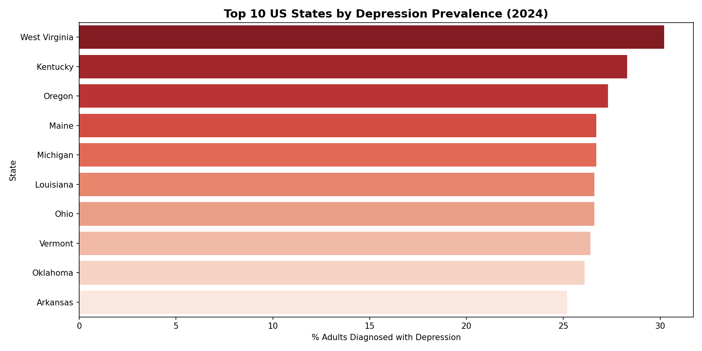
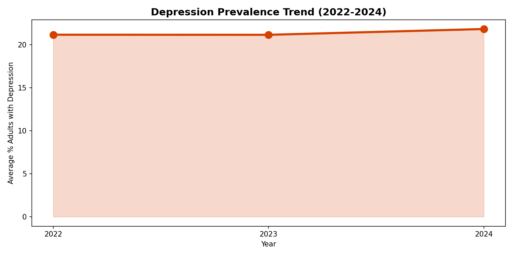
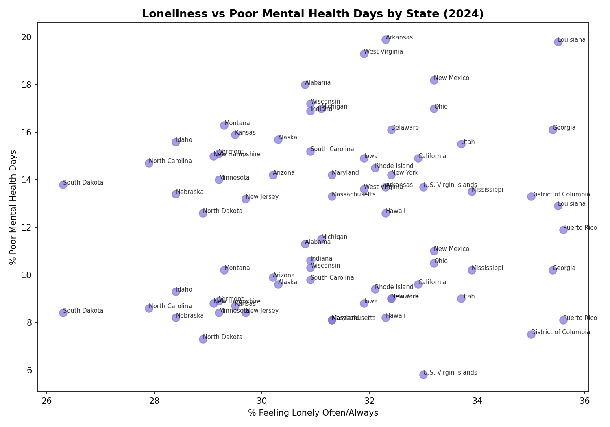
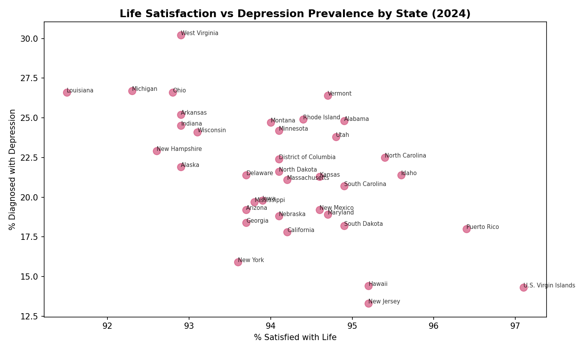
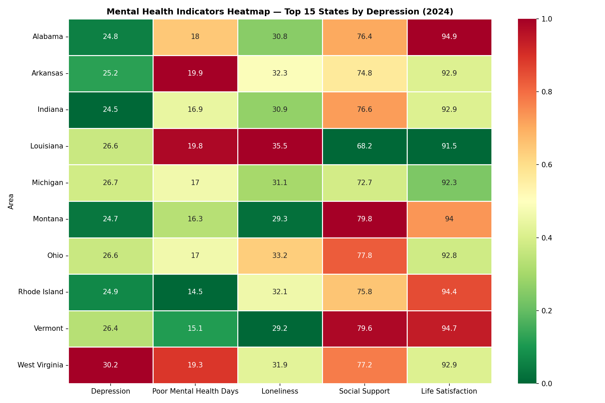

# BRFSS Mental Health Analysis (Python + CDC Data)

Python-based epidemiological analysis of mental health indicators 
across US states using CDC Behavioral Risk Factor Surveillance 
System (BRFSS) data — 1,086 records across 2022-2024.

## About
This project analyses population-level mental health trends across 
all 50 US states using official CDC surveillance data. The analysis 
examines depression prevalence, loneliness, social support, life 
satisfaction, and poor mental health days — identifying geographic 
disparities and temporal trends relevant to public health policy.

## Key Findings
- **National depression prevalence ~21-22%** — no improvement 2022-2024
- **West Virginia** has the highest depression rate at **30.2%** (2024)
- **Strong correlation** between loneliness and poor mental health days
- **Negative correlation** between life satisfaction and depression rates
- Southern and Appalachian states consistently show worst mental health outcomes
- Social isolation is a key modifiable risk factor at population level

## Analysis Includes
- Depression prevalence by state (2024)
- Mental health trend analysis (2022-2024)
- Loneliness vs poor mental health days correlation (scatter plot)
- Life satisfaction vs depression correlation (scatter plot)
- Multi-indicator heatmap across highest-burden states

## Charts

## Public Health Implications
- Mental health crisis is not improving at population level
- Geographic disparities require targeted state-level interventions
- Social isolation programmes could reduce depression burden
- Life satisfaction initiatives may have measurable mental health impact

## Dataset
CDC Behavioral Risk Factor Surveillance System (BRFSS) — Mental 
Health Indicators. Publicly available at data.cdc.gov. Covers 
1,086 records across 7 mental health questions, 50 states, 
and 3 years (2022-2024).

## Tools Used
- **Python 3.9** — pandas, matplotlib, seaborn, scikit-learn
- **Jupyter Notebook** — interactive analysis environment
- **Data source** — CDC BRFSS (data.cdc.gov)

## Files
| File | Description |
|------|-------------|
| `BRFSS_Mental_Health_Analysis.ipynb` | Full Python analysis notebook |
| `brfss_mental_health.csv` | CDC BRFSS mental health dataset |
| `chart1_depression_by_state.png` | Top 10 states by depression rate |
| `chart2_depression_trend.png` | National trend 2022-2024 |
| `chart3_loneliness_vs_mentalhealth.png` | Loneliness correlation |
| `chart4_lifesatisfaction_vs_depression.png` | Life satisfaction correlation |
| `chart5_heatmap.png` | Multi-indicator heatmap |

## Author
Dr. Sadiya Banu | Public Health Researcher | MPH, Anglia Ruskin University# BRFSS-Mental-Health-Analysis
